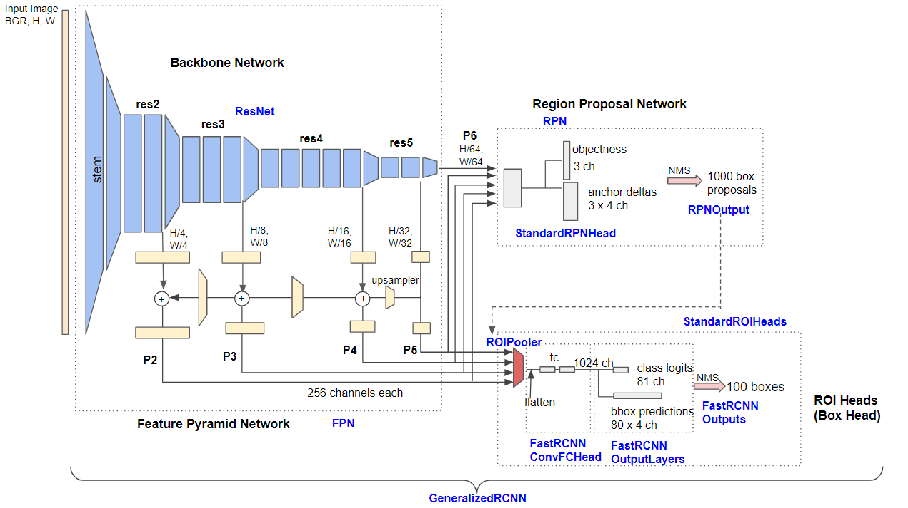

# Detectron2

Complex Dectectron2 model that can detect zones and inhibitions in a given image.
# Detection and Segmentation
 # steps to build detectron2
1) Right now it only support ubuntu and MacOS.
2) Installation:
  i) Using pip 
    python -m pip install 'git+https://github.com/facebookresearch/detectron2.git'
  ii) Using clone
    git clone https://github.com/facebookresearch/detectron2.git
    python -m pip install -e detectron2
  iii) If you have cuda(GPU) :
    There are different wheel links for each torch and cuda :
    Please refer below link for same.
    https://detectron2.readthedocs.io/en/latest/tutorials/install.html#install-pre-built-detectron2-linux-only

## Steps needed to build the environment
  ### pip3 install -r requirements.txt

## Video indexes
    1. Buisness use Case and Understanding of data . 
    2. Difference between classification,detection and Segmentation .
    3. State of Art - Detection and Segmentation
    4. Building/Installing Detectron 
    5. Understanding detectron2 from docs-Basics
    6. Running detectron2 using built-in datasets .
    7. Starts setting up Detectron2 - Training -Part 1
    8. Starts setting up Detectron2 - Training -Part 2
    9. Augmentation Techniques for Detectron
    10. Inference script and how to  test on test image
    11. Understanding how to interpret results from Detectron2
    12. Understanding visulaize.py for visualizing results
    13. Plot detection and segmentaion separately .
    14. Understanding  Project Structure for Training and training .
    15. Understanding  Project Structure for Inference and Infer .